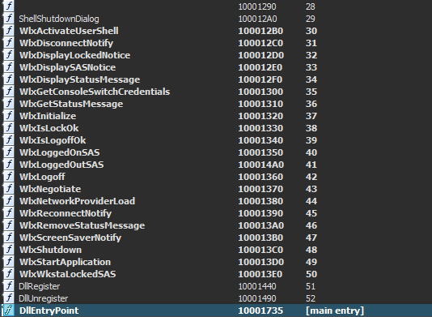

# P_M_A Lab_11_1

### Basic Static Analysis

opening with **PEStudio** found hashes, searching for it using virus total found it's detected as dropper 

looking at strings found lots of suspicious ones

from **DIE** it's not packed

So it will drop another malware from basic static and will achieve Persistence through registry 

### Basic Dynamic analysis

from process tree the malware opens **cmd**, from **procmon** it creates a file in **C:\Windows\System32** which is very suspicious it also modify and creates registers that maybe used to achive Persistence, it also created a file in the same destination under name **"msgina32.dll"**
now its enough let's restor our snapshot then start the advanced analysis

### Advansed analysis

I prefer to start both static and dynamic  together 
on **ida_pro** the frist thing opens is :

from queck look at this it creates the file mentioned before 
there is also two calls so lets set our break points there and start the analysis

frist it gets the handel to module then in the function **sub_401080** there is a call to **FindResourceA** which Determines the location of a resource with the specified type and name in the specified module named **"TGAD"** and has type of **"BINARY"** if succeded the next call is **LoadResource** which retrieves a handle that can be used to obtain a pointer to the first byte of the specified resource in memory.
if succeded we have  a handle to the data associated with the resource.
then the nex call is **LockResource** which retrieves a pointer to the specified resource in memory, then we have a pointer to the first byte of the resource
then **SizeofResource** that get the size in bytes (6656)or(0x00001A00) byte 
now **VirtualAlloc**, let's take a deep look at it's parameters 

1- protiction : here the value is 4 which means **PAGE_READWRITE** 
2- allocationtype : 1000h stands for **MEM_COMMIT** 
3-dwsize : 0x00001A00
4-lpadress : 0 The starting address of the region to allocate

so we have now allocated the memory in this adress 

then the data at the resourse are copied to **ecx**  then then anding with 3 and move again to **eax** then open file called **"msigna32.dll"** with **"wb"** mode for write in binary 
then write date using **_fwrite** and finally close the file 

here another call which contain setting buffer 

so from here there is no need to continue, It's better to goto the next function call as it's obevious that this function **(sub_401080)** is the one used to drop the malware 

let's get back to the main 

here this get handle to the created file then pass it to our target **sub_401000**

here that creates a regkey **hKey\SOFTWARE\Microsoft\Windows NT\CurrentVersion\Winlogon** 
thing to notice is the **dwoptions** set to zero stands for **"REG_OPTION_NON_VOLATILE"** 
another thing is **"samDesired"** set to **0F003Fh** which means that the key has **KEY_ALL_ACCESS** access rights 

here the malware is setting value **"GinaDLL"** to the created key then close a handle and close the file 

from this we now that 
- The malware is dropped as **msgina32.dll** from resourse **TGAD**
- The malware is being installed as GINA DLL 
- the DLL to be loaded after system reboot by adding it to **HKLM\SOFTWARE\Microsoft\Windows NT\CurrentVersion\Winlogon\
GinaDLL**.

That maybe a known Credential Stealer method called GINA Interception 
-

let's start with the dropped file **"msgina32.dll"**

### Basic Analysis2

this contains the message to be displayed which could be used to log user credentials

### Advanced analysis

the first thing to do with dll file is chicking exports

there are many functoin starts with wlx which is required by normal gina 

first the dll compare eax with one to find out the reson for dll being loaded

then the left bransh we need to examine has 
**DisableThreadLibraryCalls** which used to disables the DLL_THREAD_ATTACH and DLL_THREAD_DETACH notifications

then **GetSystemDirectoryW** wihch retrieves the path of the system directory, from here it gets an easy handle to msgina.dll then call it with **loadlibraryW** then the handle is moved from **eax** to **hLibModule** which allows the dll to call **msgina.dll functions** 

here the main ends it's time to examine exports called from the original dll

as we suspect **GINA Interception** then I started with **"WlxLoggedOutSAS"**

 

it simply uses the handle **(hLibModule)** created before to get the address through the malicious subroutine **sub_10001000** then return the address to eax and jumb there which prevent the function from creating stack fram and pushing return value as it hasn't been actually called

here there is a message to be passed to **sub_10001570**

first **_vsnwprintf** is called to write formatted output using a pointer to a list of arguments that come from **WlxLoggedOutSAS** then **_wfopen** opens **msutil32.sys** 

then **[_wstrtime,_wstrdate]** both record date and time then **fwprintf** write loged data to the opend file 
so this file is used to store stolen date after logging out 

### Tools used :

- **IDAFREE-7.7**
- **PEStudio**
- **DIE**
- **Procmon**

#### Written by

# *Karim Gomaa*

