# P_M_A Lab_12_1

# Basic Static Analysis

opening with **PEStudio** found hashes, searching for it using virus total found it's detected as trojan 

looking at strings found lots of suspicious ones

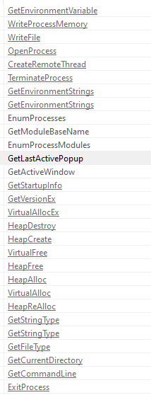

loking at it's imports found 

so from those functions we may have some process injection
from **DIE** it's not packed

# Basic Dynamic analysis

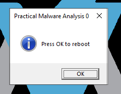

When we run the malware, it creates a message box every minute i think, from process tree the malware opens **cmd**
there is nothing important else
now its enough let's restor our snapshot then start the advanced analysis

# Advansed analysis

I prefer to start both static and dynamic  together 
on **ida_pro** the frist thing opens is :

First part of main we have lots of function calls like **LoadLibraryA** & **getProcAddress** 

the frist call has argument **"psapi.dll"** then returnes with handel to this module which is passed as argument to next function which has procname **"EnumProcessModules"** also 
that means that the malware resolving functions for Windows process enumeration within psapi.dll using **LoadLibraryA** & **getProcAddress** 
then saves the function pointers to dword_408714

then it repeats the process with all functions trying to resolve 

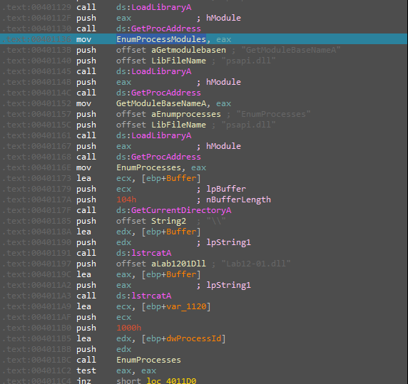

the thing to obvious here is the global variables **"EnumProcessModules,GetModuleBaseNameA,EnumProcesses"**

after that, it gets the current directory and append **"Lab12-01.dll"** to it 

after that all a little nice call to **" EnumProcesses"** occurs which retrieves the process identifier(PID) for each process object in the system which will be stored in **"dwProcessId"**, If the function succeeds, the return value is nonzero and the jump go to the loop

in a very simple way it passes each (PID) as an argument to **sub_401000** then if the return value is **1** it calles **OpenProcess** and store the handle in **hProcess**

if the handle = -1 it termenates the program else contenue and set the counter to 7D0h(2000) 

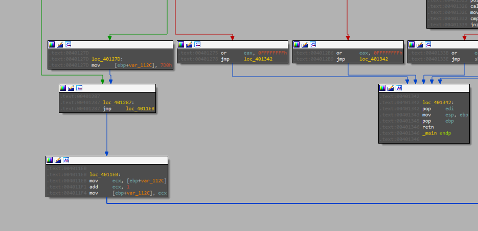

the loop ends when the edi isnot blew 40h which stored in  **[ebp+var_117C]** 

so now what happens in **sub_401000**?

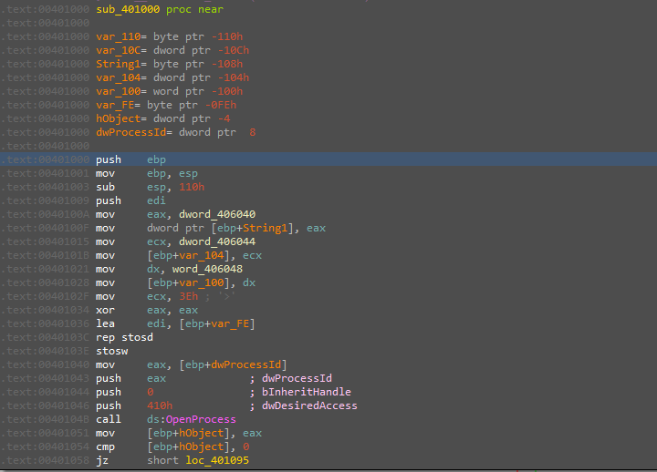

first opens process gevin as argument using its PID
then if succeded it jump to call **EnumProcessModules** to retrieves a handle for each module in the specified process then if succeded it jump to call **GetModuleBaseNameA** to retrieves the base name of the specified module

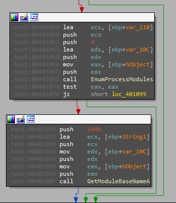

the last part of this function 

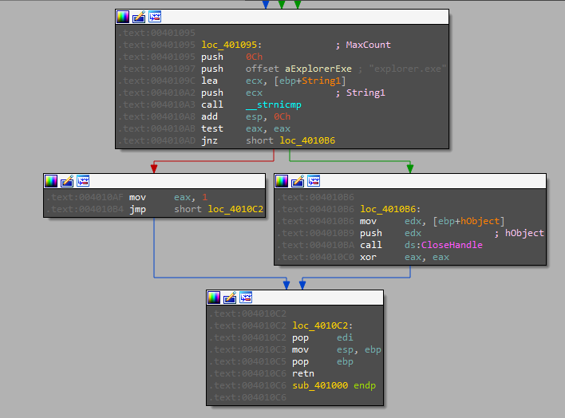

it's comparing the name of the module to **"explorer.exe"** if equal close handle and return 0
else return 1

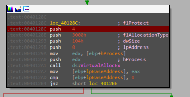

when the loop is done it tries to allocate vertual  memory 
if this allocation failed the program ends else contenue to next scope

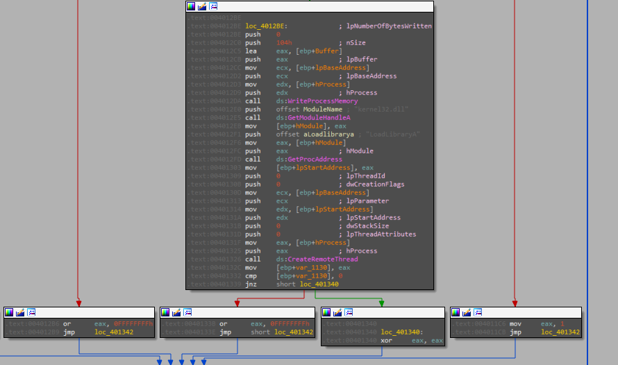

here it writes to process Memory 
from **hProcess,lpBuffer** we knew that it tries to enject **explorer.exe** memory with **"C:\Users\Golden\Desktop\PracticalMalwareAnalysis-Labs-master\Practical Malware Analysis Labs\BinaryCollection\Chapter_12L\Lab12-01.dll"**
which is the malicious dll file

# DLL

# Basic Analysis

it's 32 and not packed 

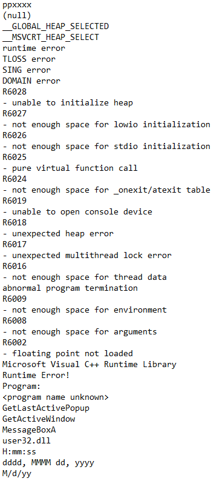
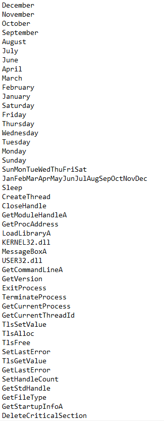

these strings took my eyes 
it may creat threads, steal information inject some another code

### Advanced analysis

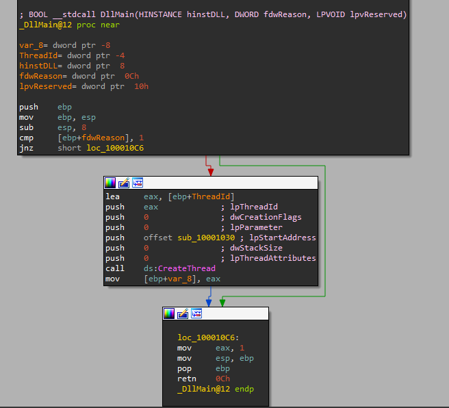

it simply creats Thread and have only one function call to **sub_10001030**
so let's dive into that call

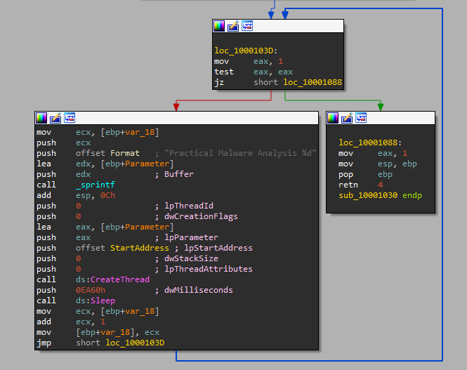

this creats a message box with title **"Practical Malware Analysis %d"** where **%d** is replaced with numerical value starting from 0 and increasing by 1 then sleep for **0EA60h** which is **60000 ms** that means a minute then repeats

now i know that **"explorer.exe"** is being injected and how that happen
on restarting **"explorer.exe"** the Pop_ups disappears

# conclusion

Lab 12-01.exe performs a dll injection into explorer.exe with Lab 12-01.dll
Lab 12-01.dll creats an annoying pop_up every minute with counter shows how many times it appeared

to get red of you can simply restart explorer.exe

# Tools used :

- **IDAPRO-7.7**
- **PEStudio**
- **DIE**
- **Procmon**

#### Written by

# *Karim Gomaa*